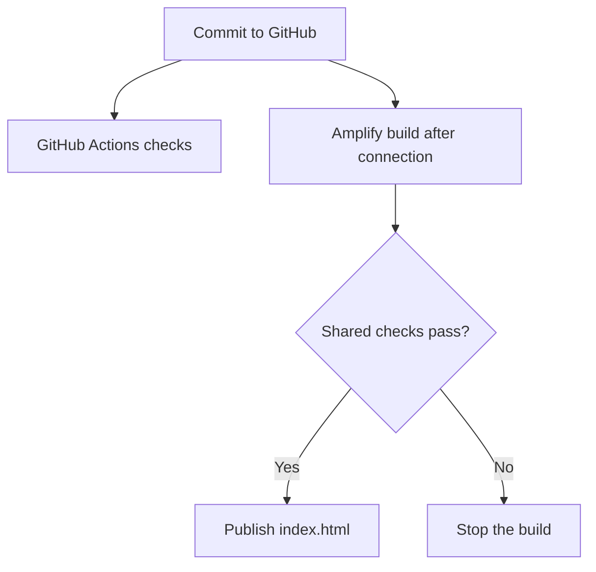
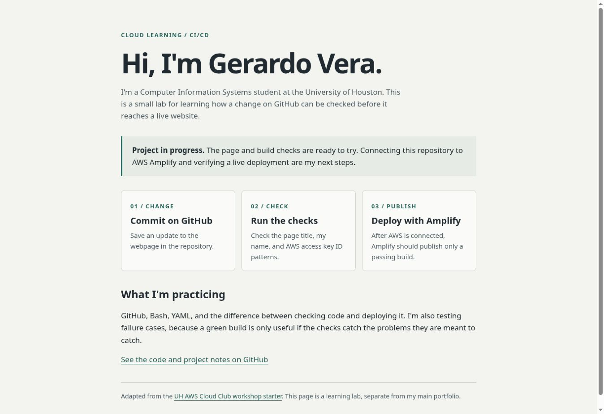

# AWS Amplify Pipeline Lab

I'm using this project to practice CI/CD with a small webpage instead of starting with a big app. The goal is to make a change on GitHub, check it automatically, and let AWS Amplify publish it only if the checks pass.

This is my personal copy of the [UH AWS Cloud Club workshop starter](https://github.com/uhawscloudclub/pipeline-starter-aws), based on its September 30, 2026 version (`2ac541c`). The original workshop supplied the page, Amplify configuration, and idea of testing a broken title and a fake AWS key. My copy adds a personalized page, a shared check script, a name check, failure-case tests, and GitHub Actions. The original repository is unchanged.

**Status: in progress.** Local checks and nine tests pass. The AWS connection, live deployment, and failed-deployment behavior still need to be verified on my AWS account. There is no live Amplify URL yet.

## What this project does

- Shows a simple page about the lab.
- Checks for a nonempty page title and my name.
- Looks for AWS access key ID patterns in text files, including documentation.
- Runs the same checks on GitHub pushes and pull requests.
- Gives Amplify the same check command and publishes only `index.html` after it passes.

**Tools:** HTML/CSS, Bash, YAML, GitHub Actions, Python's built-in unittest module, and AWS Amplify Hosting (deployment pending).

## Try it locally

Open `index.html` in a browser. To run the checks, use Bash and Python 3 (Linux, macOS, or WSL):

```bash
bash scripts/check.sh
python3 -m unittest discover -s tests -v
```

There are no Python packages to install. Tests use temporary files and do not change the working page.

## How it fits together

GitHub Actions checks the repository. Amplify will separately run `amplify.yml` after it is connected. A green GitHub check alone does not mean the website has deployed, and it does not block someone from merging a change.



## Project notes and evidence



This screenshot is from a local browser preview. It is not proof of an AWS deployment.

- [Build checks and test results](docs/project-notes.md)
- [AWS setup and evidence checklist](docs/deployment.md)
- Passing and failing examples are in `tests/test_checks.py`.
- Hosted CI results appear in this repository's Actions tab. AWS evidence will be added after deployment.

## Limits

The key check is a small pattern check, not a full secret scanner. It recognizes IDs starting with `AKIA` or `ASIA` followed by 16 uppercase letters or digits. It does not detect every kind of secret, scan Git history, scan binary files/images, or prevent a bad commit from reaching GitHub. It lists filenames instead of printing a possible credential. If a real credential leaks, revoke it; deleting a file or blocking a deployment does not undo the leak.

The title and name checks are also basic text checks, not complete HTML validation. They expect the title on one line and cannot prove content is visible to a visitor.

## Next steps

- [ ] Connect this repository to Amplify.
- [ ] Record the first successful deployment and live URL.
- [ ] Verify a failed build leaves the last working page available.
- [ ] Add screenshots of AWS results and a short walkthrough video.

This project was prepared with AI assistance for setup, code, documentation, and tests. I still need to work through the AWS steps and explain the results in my own words.
